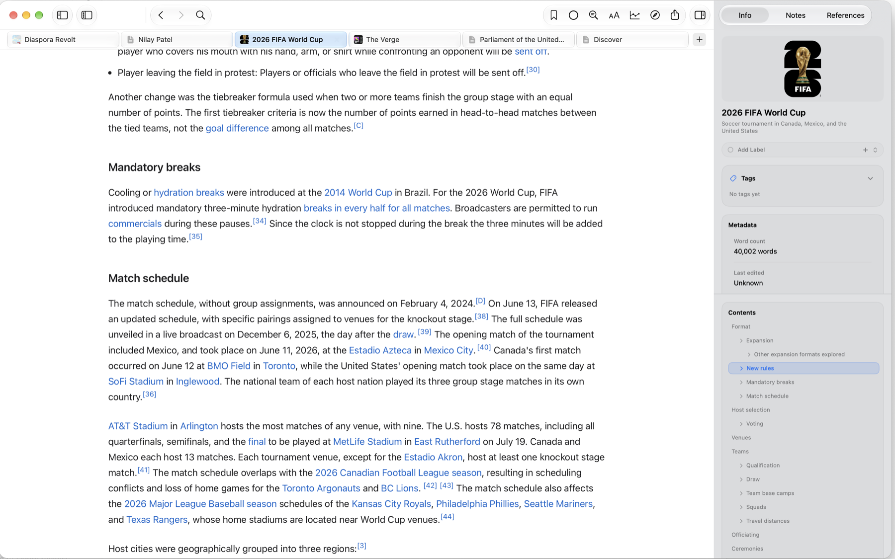
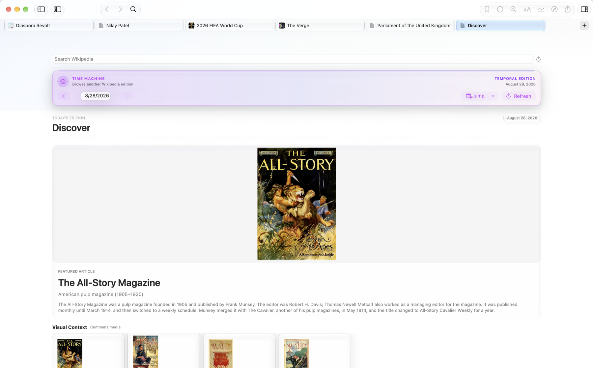
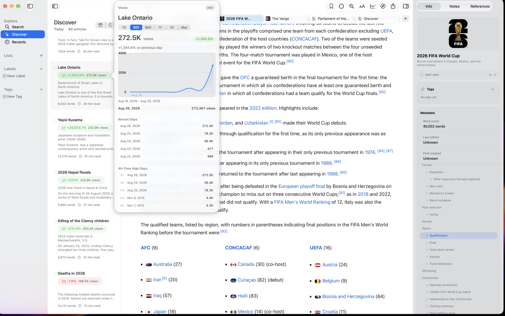

# MacWiki

MacWiki is a native macOS Wikipedia client that makes research a pleasure. It combines the depth of Wikipedia with the polish of Apple's best apps, with Readwise integration reserved for a future release.

Wikipedia on the web is cluttered, disconnected from a reader's research workflow, awkward for keyboard-driven work, and poorly suited to comparing articles. MacWiki approaches those problems as a native Mac app:

- **Focuses on content:** A four-column layout—Lists → Directory → Reader → Inspector—puts articles front and center.
- **Prepares for connected workflows:** Local highlights are first-class today; bidirectional Readwise sync is planned, not implemented.
- **Embraces the keyboard:** Navigate the app without reaching for the mouse.
- **Enables comparison:** Tabs and multiple windows support deep research across articles.
- **Keeps work available:** Save articles and reading lists locally for later.

## Screenshots


| Focused Reader and Contents | Time Machine discovery |
| --- | --- |
|  |  |
| **Page-view trends** | **Research workspace** |
|  | Tabs, reading history, metadata, references, and article navigation remain available in one native workspace. |

## Design Philosophy

### Apple-native feel

MacWiki should feel like it shipped with macOS. Interactions follow Apple's Human Interface Guidelines, while Liquid Glass gives the interface depth without turning translucency into a gimmick.

### Research first

The app is optimized for deep research sessions rather than casual browsing. Reading lists, annotations, article metadata, references, and connections are treated as first-class parts of the reading experience.

### Keyboard power

Power users can move through the app by keyboard, with standard shortcuts and quick actions that behave as expected on macOS.

### Connected knowledge

Articles do not exist in isolation. The Inspector surfaces metadata, references, highlights, and the context around what you are reading.

### Performance is the product

MacWiki is only worth building if it feels alive in motion. Reader scrolling and table-of-contents navigation should feel fluid enough that the interface disappears and the reading flow remains intact. Safari on the same Mac is the baseline to meet or beat.

## Built with AI

MacWiki was developed through sustained human–AI collaboration across product design, native implementation, debugging, accessibility, and test coverage. The commit history shows that work evolving through small, reviewable iterations.

## Requirements

- macOS 26.0+
- Xcode 26 or newer
- Swift 6.2+

MacWiki intentionally targets macOS 26 and newer so the app can lean on the current SwiftUI, AppKit, and Liquid Glass system behavior without carrying older-system compatibility branches.

## Quick Start

```bash
# Open in Xcode (SPM)
xed .

# Build from command line
swift build

# Run the app
.build/debug/MacWiki
```

## Project Structure

```
MacWiki/
├── Sources/MacWiki/
│   ├── App/           # Application entry point
│   ├── Models/        # Data models
│   ├── Services/      # API and persistence
│   ├── Views/         # SwiftUI views
│   └── Utilities/     # Helpers and extensions
└── Tests/             # Unit tests
```

## Related AI Experiment

The companion [Obsidian Election Research Workspace](https://github.com/TomBunting1243/obsidian-election-research-workspace) shows the same human–AI working method in a different medium: a source-aware research dashboard extracted into a reusable starter vault with synthetic fixtures, schema validation, and accessibility contracts.

## Open Source

MacWiki is open source primarily so people can clone it, modify it, and build their own versions.

- Hacking guide: `CONTRIBUTING.md`
- Conduct: `CODE_OF_CONDUCT.md`
- Security reporting: `SECURITY.md`

## License

Apache-2.0. See `LICENSE`.

## Trademark

The MacWiki name and logo are trademarks. See `TRADEMARK.md`.
